# FASTFFS - The Fast Atomic Sector Table Flash File System

***It's FAST, FFS!*** [[1]](#benchmark-snapshot)

FASTFFS is a small NOR flash filesystem prototype for embedded systems that
create, replace, list, and read named files. It is aimed at workloads with many
small to medium files, from a few bytes to tens of KB, a few larger files in the
hundreds of KB, and whole file updates rather than POSIX style random
write/update capabilities.

The target storage shape is roughly 2-12 MB of NOR flash with hundreds to low
thousands of files.

The core idea is simple: file data is written copy-on-write into flash sectors,
then a compact append-only index record commits the namespace update. On
remount, the index is replayed to recover the current set of names. Old file
versions and interrupted writes are left as obsolete or orphaned data for later
reclamation.

Like most flash filesystems FASTFFS is designed to be safe for use in the face
of unexpected power failures and crashes. It's designed to preserve committed
data across interrupted writes.

Unlike most flash filesystems, FASTFFS is designed to be fast. FASTFFS systems
usually run GC (garbage collection) opportunistically in small background steps,
keeping file operations as fast as possible. It still works without background
GC, but is much faster with it.

## Design Goals

1. Embedded / microcontroller environments: limited static RAM, lightweight code.
2. Safe, crash/power failure resilient, atomic updates of file data and metadata.
3. Fast, reduce file read/write overhead as much as possible.
4. Optimal for its designed workload.
5. Reasonable flash wear leveling. 
6. Usable in a variety of use cases, without trying to be everything.

## What Exists Now

- A portable C core API in `include/fastffs/fastffs.h`.
- Format, mount, open, read, write, close, stat, exists, list, delete, and
  directory iteration operations.
- Caller owned filesystem, file, directory, cache, scratch, and allocation-map
  state; the core does not allocate from the heap.
- A sector based flash format with index sectors, compact namespace records,
  file metadata, forward extent links, overwrite/delete commits, index
  rotation/compaction, small background GC steps, and inline GC under pressure.
- Packed small-file storage so tiny files do not each consume a whole sector.
- Configurable index cache modes, including no cache, hash table, and full table builds.
- A host verification flash backend derived from the LittleFS emulator, with
  NOR programming rules, operation accounting, fake timing, failure injection,
  crash/reopen snapshots, and image inspection support.
- Host tools for creating, loading, dumping, checking, probing, and sweeping
  FASTFFS images.
- ESP32 S3 benchmark harnesses used to compare candidate filesystems against
  LittleFS, FatFs, JesFS, and SPIFFS.

## Near Future Goals

- Optional CRC32 protected file data + metadata.
- Multi file atomic transactions.
- Accelerated directory listing. FASTFFS already supports prefix filtering.
- Sector compaction of live data.
- Attribute and long name support.
- Append oriented workloads like logs, data loggers, etc.
- Key Value optimized workloads, like extra tiny files.

## Concepts

FASTFFS uses "sector" as its allocation, metadata, scan, and reclaim unit. The
default sector size is 4 KB, with the encoded sector size stored in the index
headers so mounted images can discover the format.

The namespace index is an append-only log of small records. Each record stores a
collision resolved 16 bit slot and a head sector. A head of zero is a delete
tombstone; otherwise the head points at the sector containing the root metadata
for the current file version. Later records win during replay.

File replacement is intentionally commit oriented. New data and metadata are
written first, and the namespace changes only when the new index record is
appended. That keeps the old committed file visible if an interrupted write does
not reach the commit point.

## Build And Test

```sh
make test
make test-sanitize
```

Additional targets in the `Makefile` exercise cache variants, churn workloads,
timing probes, and crash sweeps.

See `design.md` for the deeper design notes.

## Benchmark Snapshot

This is a comparison of other permissively licensed filesystems that were reasonably easy to port/integrate. There are many others, but most appeared to be glued to a whole operating system.

Across the captured benchmark stats, FASTFFS leads every write-throughput
measurement from 64 B through 350 KB. It writes tiny files about 5x faster than
the fastest tested non-FASTFFS result, writes 50 KB files about 1.9x faster, and
completes the churn workload simulation about 1.2x faster than LittleFS,
1.5x faster than JesFS, and 1.8x faster than FATFS.

FASTFFS has the fastest tiny-file reads and stays stable across early, middle,
and late index positions.

FASTFFS mounts quickly after churn, even though it replays its compact index log
on mount, at about 2x faster than the next tested non-FASTFFS result.

FASTFFS completes a small file stress test about 12x faster than SPIFFS, while LittleFS, FATFS, and JesFS failed before reaching the write target and were much slower before failing. This test writes many 1 B-5 KB files while keeping live payload around 55% of the partition size.

By default, FASTFFS uses RAM to speed up certain operations, but these are configurable. Even a minimal-RAM configuration stays faster than the other tested filesystems on the fixed 64 B and 50 KB write tests, completes the small files stress test, and remains competitive in other aspects.

FASTFFS runs measured GC steps between foreground operations; that GC time is
included in total churn runtime. This roughly simulates spending some idle cycles
on GC opportunistically, instead of forcing foreground writes to pay the whole
reclaim cost when free space is tight.

The churn benchmark writes about 8.2 MB of creates/replaces/deletes while keeping about 2.2-2.4 MB live, measuring mutation throughput during the run and final live-set read/list behavior over the 105 surviving files.

Tested on ESP32-S3, ESP-IDF v6.0-beta2, 4 MB data partition.

<p>
  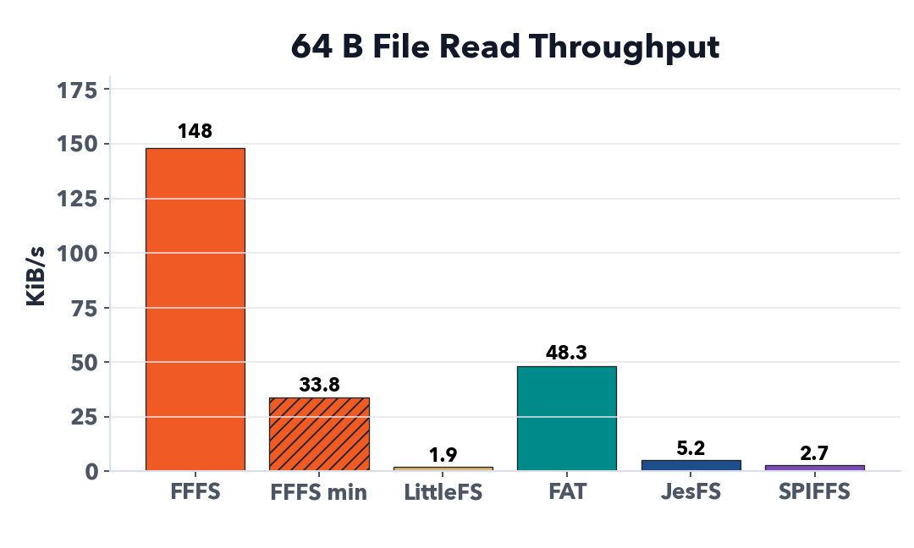
  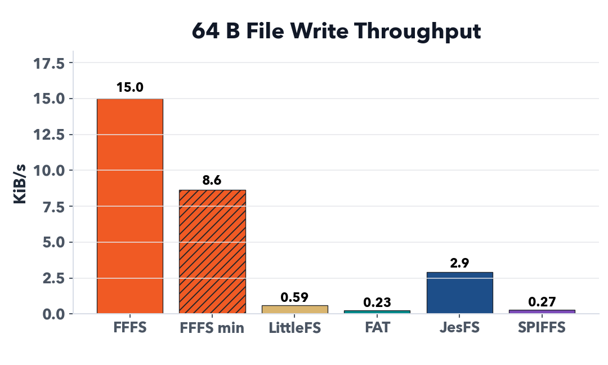
</p>

<p>
  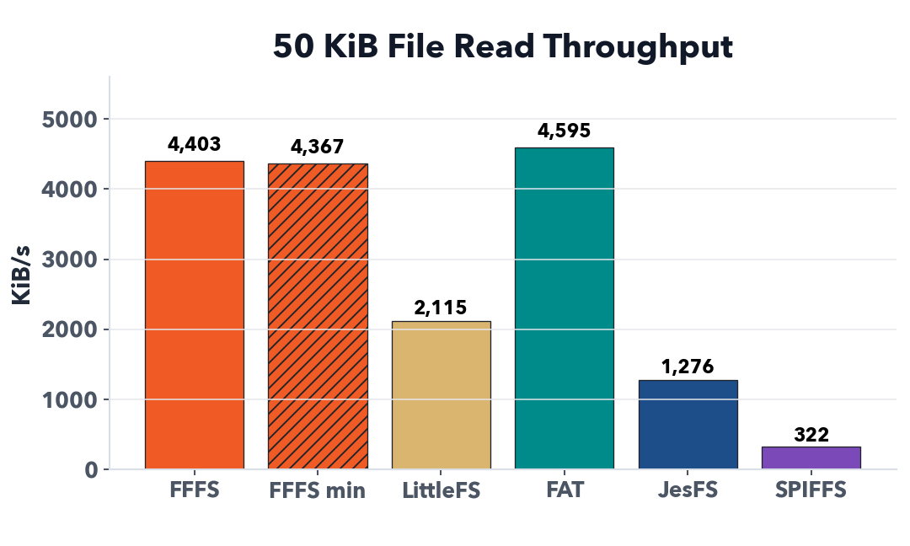
  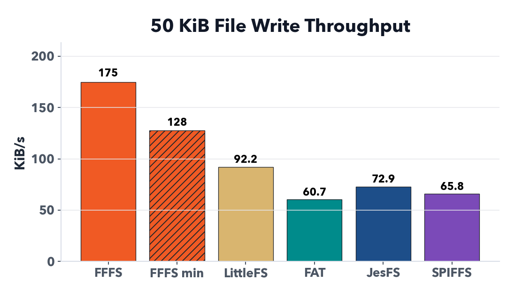
</p>

<p>
  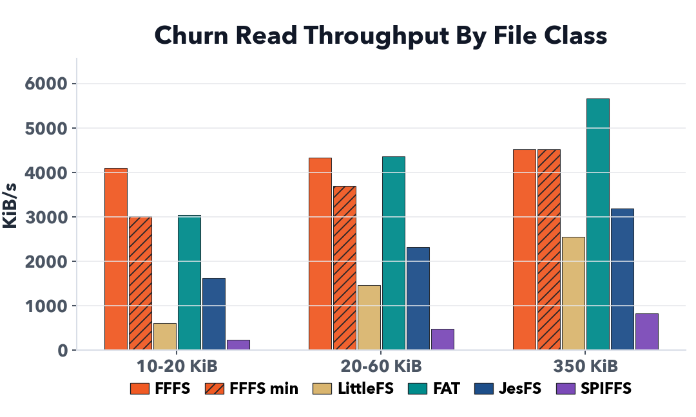
  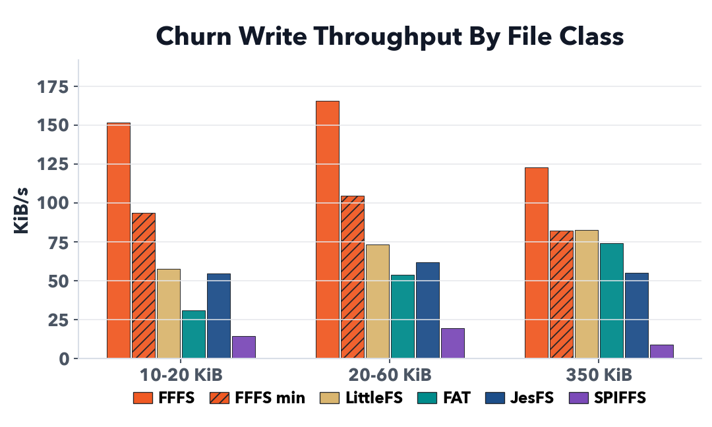
</p>

<p>
  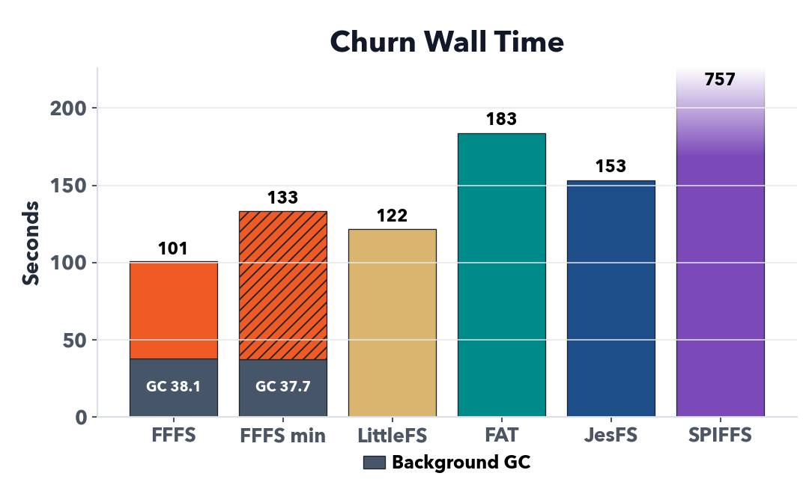
  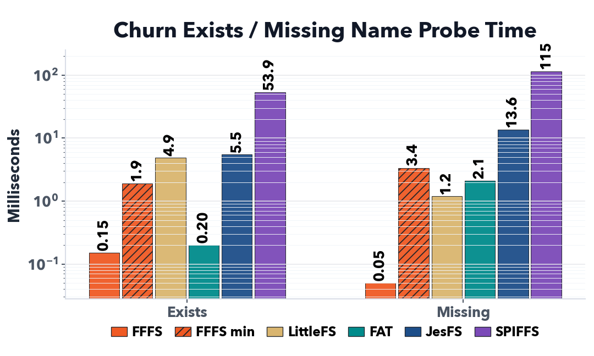
</p>

<p>
  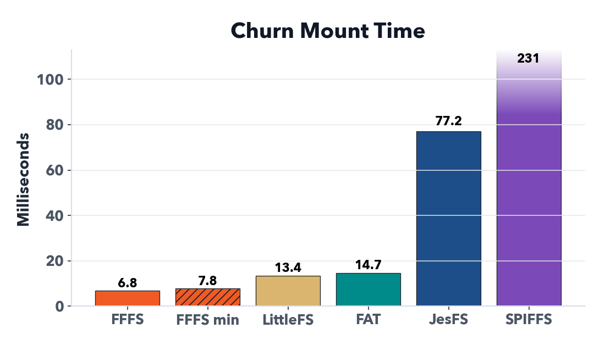
  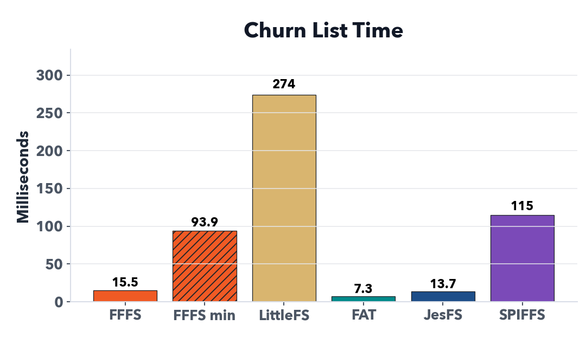
</p>

<p>
  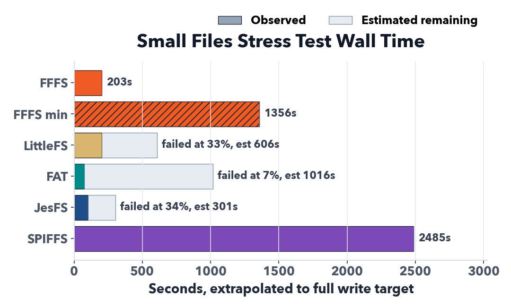
</p>

| Metric | FASTFFS default debt-GC | FASTFFS minimal debt-GC | [LittleFS](https://github.com/littlefs-project/littlefs) | FATFS + ESP-IDF WL | [JesFS](https://github.com/joembedded/JesFs) | [SPIFFS](https://github.com/pellepl/spiffs) |
|---|---:|---:|---:|---:|---:|---:|
| FS memory, base + open + stack | 4,924 B + 360 B + 1,284 B | 308 B + 168 B + 1,244 B | 1,672 B + 756 B + 1,444 B | 9,996 B + n/a + 1,344 B | 164 B + 28 B + 1,236 B | 3,540 B + 80 B + 1,328 B |
| Tiny-file overhead, 192 x 64 B | 16 B/file | 16 B/file | 448 B/file | 4,032 B/file | 4,032 B/file | 438 B/file |
| Write 192 x 64 B | 15.0 KiB/s | 8.64 KiB/s | 0.59 KiB/s | 0.23 KiB/s | 2.93 KiB/s | 0.27 KiB/s |
| Read 192 x 64 B total | 148.1 KiB/s | 33.8 KiB/s | 1.95 KiB/s | 48.3 KiB/s | 5.21 KiB/s | 2.70 KiB/s |
| Read 192 x 64 B open/file | 259 us | 1.62 ms | 11.1 ms | 580 us | 11.9 ms | 22.9 ms |
| Write 16 x 50 KiB | 174.9 KiB/s | 127.6 KiB/s | 92.2 KiB/s | 60.7 KiB/s | 72.9 KiB/s | 65.8 KiB/s |
| Read 16 x 50 KiB total | 4,403 KiB/s | 4,367 KiB/s | 2,115 KiB/s | 4,595 KiB/s | 1,276 KiB/s | 322.5 KiB/s |
| List 208 files | 32.0 ms | 107 ms | 307 ms | 8.29 ms | 26.4 ms | 123 ms |
| Existing-name probe | 158 us | 1.52 ms | 20.0 ms | 951 us | 12.0 ms | 24.6 ms |
| Missing-name probe | 77 us | 2.40 ms | 16.6 ms | 1.02 ms | 26.4 ms | 121 ms |
| Churn total wall time | 100.792 s | 133.416 s | 121.812 s | 183.485 s | 153.217 s | 757.174 s |
| Churn 10-20 KiB write | 151.6 KiB/s | 93.8 KiB/s | 57.7 KiB/s | 31.2 KiB/s | 54.6 KiB/s | 14.4 KiB/s |
| Churn 20-60 KiB write | 165.4 KiB/s | 104.5 KiB/s | 73.4 KiB/s | 53.7 KiB/s | 62.1 KiB/s | 19.5 KiB/s |
| Churn 350 KiB write | 123.0 KiB/s | 82.4 KiB/s | 82.6 KiB/s | 74.2 KiB/s | 55.2 KiB/s | 9.02 KiB/s |
| Mount after churn | 6.80 ms | 7.81 ms | 13.4 ms | 14.7 ms | 77.2 ms | 231 ms |
| Churn final cold list, 105 files | 15.5 ms | 93.9 ms | 274 ms | 7.29 ms | 13.7 ms | 115 ms |
| Churn cold read 350 KiB total | 4,517 KiB/s | 4,528 KiB/s | 2,554 KiB/s | 5,662 KiB/s | 3,194 KiB/s | 828.8 KiB/s |
| Smallfiles result | completed | completed | 33% (failed) | 7% (failed) | 34% (failed) | completed |
| Smallfiles total wall time | 202.509 s | 1355.535 s | 201.470 s | 75.850 s | 102.159 s | 2485.149 s |
| Smallfiles write 1-5120 B | 49.8 KiB/s | 6.73 KiB/s | 13.7 KiB/s | 8.08 KiB/s | 27.3 KiB/s | 3.51 KiB/s |

## Power Loss And Corruption Testing

FASTFFS avoids corruption by ordering writes so new file data is
not reachable until the final index record is appended. If power fails
while writing file payload or file metadata, the old committed file remains
and the incomplete write is left as orphaned data for later GC. If power fails
while appending the final index record, the last record may be invalid and is
checked on mount. If recovery is allowed and the bad record is provably the end
of the index, the partial record is effectively removed by overwriting it,
leaving the filesystem in the previous valid state. This ensures that committed
data remains intact and readable, and partial writes do not corrupt any previous
data.

FASTFFS builds upon the LittleFS test flash emulation and fault-injection
system.

The verifier models more than simple before/after operation failure. It
uses a NOR-like backend derived from LittleFS `emubd` to simulate multiple
possible persisted state outcomes at every possible program/erase. By
randomizing eligible bits inside sampled program and erase operations, it fuzzes
single and multi-bit partial write outcomes across index records, metadata,
payloads, footers, and lifecycle fields. Each sampled crash branch is remounted
and checked against the expected committed namespace. Visible files are read
back byte-for-byte through a deterministic namespace hash. Thorough sweeps also
run the internal sector inspector. High-volume sweeps can run namespace-only to
spend the time on more crash points and partial-program branches.

Recent host sweep evidence:

| Sweep | Geometry | Workload | Crash Points | Partial Fault Cases | Result |
|---|---:|---:|---:|---:|---:|
| API crash sweep, namespace-only | 4 KiB sectors, 512 KiB image | 3,051,374 API steps, 168.4 MB writes, 37,925 deletes | 45,744,322 | 43,092,792 | 0 failures |
| API crash sweep, namespace-only | 256 B sectors, 64 KiB image | 8,572,968 API steps, 425.4 MB writes, 218,790 deletes | 273,580,857 | 243,182,984 | 0 failures |

The 256 B sector run intentionally creates frequent index rotation, index
compaction, GC pressure, and long file chains. The 4 KiB sector run matches a
more typical NOR erase-sector geometry.

## Notes in no particular order

JesFS really punches above its weight. It's simple and lightweight.

LittleFS has some really solid test/verification stuff, and has really improved over time. I've borrowed their flash emulation framework to verify FASTFFS.

Some design concepts were borrowed from Zephyr ZMS.
